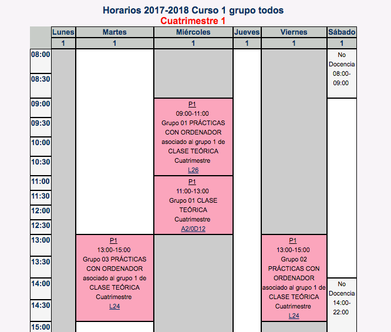

## Programación 1. Grado de Robótica

Toda la información está disponible en el [sitio Moodle de P1](https://moodle2017-18.ua.es/moodle/course/view.php?id=247) y en la
[ficha del campus virtual](http://cv1.cpd.ua.es/ConsPlanesEstudio/cvFichaAsiEEES.asp?wCodEst=C211&wcodasi=33704&wLengua=C&scaca=2017-18).

### Datos académicos de la asignatura

**Departamento de Ciencia de la Computación e Inteligencia Artificial**  
**6 créditos ECTS**: 1 clase de teoría de 2 h. y 1 clase de
prácticas de 2 h. a la semana  

**Profesores**:  

* Antonio Botía ([e-mail](mailto:abotia@dccia.ua.es)): Grupos de prácticas: 2 y 3.
* Cristina Pomares ([e-mail](mailto:cpomares@ua.es)): Grupo de teoría: 1. Grupo de prácticas: 1.

### Recursos de la asignatura

* [Sitio Moodle](https://moodle2017-18.ua.es/moodle/course/view.php?id=247)
  abierto y accesible a toda la comunidad educativa, contiene los
  apuntes, transparencias, prácticas y otros materiales docentes
* [Foro de consultas y anuncios](https://moodle2017-18.ua.es/moodle/mod/forum/view.php?id=12384)
  en el sitio Moodle (sólo accesible a estudiantes)

### Objetivos y competencias

**Objetivos**:

* Dominar los principios de la programación procedural.
* Resolver problemas de programación básica aplicando adecuadamente los tipos de datos elementales, los tipos de datos estructurados y las estructuras de control.
* Asimilar el concepto programación modular y saber aplicarlo en la resolución de problemas.
* Conocer el concepto de recursividad, aplicándolo a problemas sencillos.
* Comprender el concepto de fichero y saber utilizarlos.
* Ser capaz de utilizar herramientas de programación para editar, compilar, ejecutar y verificar un programa.
* Analizar problemas susceptibles de resolución por un ordenador y diseñar algoritmos que los solucionen.
* Implementar algoritmos mediante técnicas de programación estructurada y modular.
* Saber realizar programas de ordenador que capturen y envíen información a un sistema robótico.

**Competencias**:

* Interpretar el funcionamiento del código fuente de un programa.
* Definir los tipos de datos necesarios para la representación de la información.
* Diseñar algoritmos y codificarlos con distintas técnicas de programación, especialmente en sistemas robóticos.
* Verificar el correcto funcionamiento de un programa.

### Temario

* Tema 1. **Introducción a la programación**: Representación de la información. Concepto de programa. Fases de desarrollo de un programa. El lenguaje C. Estructura de un programa. Comentarios en un programa. Entornos de programación.

* Tema 2. **Tipos de datos simples**: Concepto de dato. Constantes y variables. Sentencias de asignación. Expresiones y operadores. Sentencias de entrada/salida de datos.

* Tema 3. **Sentencias de control**: Algoritmos y programas. Estructura secuencial. Estructuras de selección. Estructuras de repetición.

* Tema 4. **Programación modular**: Descomposición modular. Concepto de módulo. Comunicación entre módulos. Procedimientos y funciones. Parámetros actuales y formales. Paso de parámetros por valor y por referencia. Ámbito de una variable. Variables globales y locales. Efecto lateral. Funciones predefinidas

* Tema 5. **Recursión**: Definición. Esquema básico. Codificación en C. Características

* Tema 6. **Tipos de datos estructurados: Arrays**: Concepto de dato estructurado. El tipo array. Arrays unidimensionales, bidimensionales y multidimensionales. Cadenas de caracteres

* Tema 7. **Punteros y memoria dinámica**: Memoria estática vs. dinámica. Creación, inicialización, asignación y liberación de memoria. Conversión de tipos.

* Tema 8. **Tipos de datos estructurados: Registros**: Concepto de registro. Registros en C. Operaciones sobre registros. Arrays de registro

* Tema 9. **Entrada/salida**: Declaración, apertura, lectura y escritura de ficheros de texto y binarios en C.

### Prácticas

Durante las horas prácticas se realizarán de forma **individual** ejercicios de programación relacionados con los conceptos que se están estudiando en ese momento que servirán para reforzar y profundizar en las competencias de la asignatura.

Se realizarán 2 prácticas:

* La primera práctica será guiada, distribuida en sesiones de forma incremental para que semana a semana se vaya construyendo una solución parcial hasta llegar a la implementación total.
* La segunda práctica será un problema a desarrollar por el alumno

### Horarios

La distribución de grupos del curso 2017-18 es la siguiente:

### Evaluación

#### Convocatoria normal (evaluación continua)

En la convocatoria ordinaria (enero) se realizará una evaluación continua con las siguientes pruebas:

* **Parte práctica**:
     - *Control de prácticas 1*: pondera un 10% de la nota final
     - *Control de prácticas 2*: pondera un 30% de la nota final
* **Parte teórica**:
     - *Control de teoría*: pondera un 10% de la nota final
     - *Examen de teoría*: pondera un 50% de la nota final. Se realizará en la fecha oficial asignada al examen final de la convocatoria de enero

La calificación final de la asignatura se obtiene mediante la suma ponderada de todas las pruebas.

En las pruebas se valora especialmente el diseño de los programas y el correcto estilo de programación así como la ausencia de errores.

Las entregas de las prácticas no ponderarán para la calificación final, pero son esenciales para el aprendizaje de los conceptos, técnicas de la asignatura y para la preparación de los controles de prácticas. En estos controles se evaluará el conocimiento que el alumno ha adquirido con la realización de dichas prácticas.

#### Convocatoria extraordinaria

Para la convocatoria extraordinaria de julio se podrán realizar las actividades:

- **Examen teórico**: pondera un 60% de la nota final
- **Examen práctico**: pondera un 40% de la nota final

En esta convocatoria sólo se realizará la parte (teoría o práctica) que no se haya aprobado en la convocatoria ordinaria. Es decir, si la parte teórica (control teoría * 0.1 + prueba escrita * 0.5) >= 3, se guarda la nota (un 5 mínimo sin ponderar). Lo mismo sucede con la parte práctica, si (control prácticas 1 * 0.1 + control prácticas 2 * 0.3) >= 2, se guarda la nota (un 5 mínimo sin ponderar). En estos casos sólo habría que hacer la parte no aprobada.

#### Plagios

Los trabajos teórico/prácticos realizados han de ser originales. La detección de copia o plagio supondrá la calificación de "0" en la prueba correspondiente. Se informará la dirección de Departamento y de la EPS sobre esta incidencia. La reiteración en la conducta en esta u otra asignatura conllevará la notificación al vicerrectorado correspondiente de las faltas cometidas para que estudien el caso y sancionen según la legislación (Reglamento de disciplina académica de los Centros oficiales de Enseñanza Superior y de Enseñanza Técnica dependientes del Ministerio de Educación Nacional BOE 12/10/1954).

### Bibliografía

En Moodle se publican los apuntes de la asignatura, con ejercicios, explicaciones y ejemplos de todos los conceptos estudiados, tanto en teoría como en práctica.

Para consultar o ampliar algunos conceptos se recomienda alguno de los siguientes libros:

* KOCHAN, Stephen G. Programming in C. Fourth Edition, 2015. ISBN: 978-0321776419

* KERNIGHAN, Brian W.; RITCHIE, Dennis M. El lenguaje de programación C. Pearson Educación, 1991. ISBN: 968-880-205-0

* CARRETERO Pérez, Jesús. Fundamentos de programación. 2007.  ISBN:	9788497325509

* GOTTFRIED, Byron S., et al. Programación en C. McGraw-Hill, 1991. ISBN: 9788448110680

----

Programación 1, Grado de Robótica, curso 2017-18  
© Departamento Ciencia de la Computación e Inteligencia Artificial, Universidad de Alicante  
Cristina Pomares
